# C# WPF Exercise

__교재 : 초보자를 위한 C# 200제__ (정보문화사)를 참고하였습니다. 

### WpfCalculatorApp
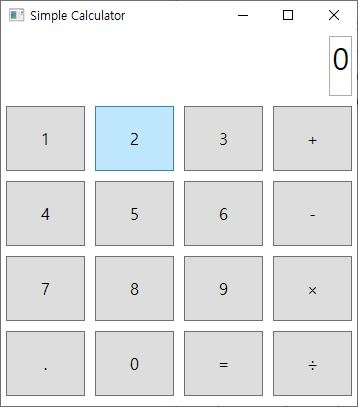
### AnalogClockApp
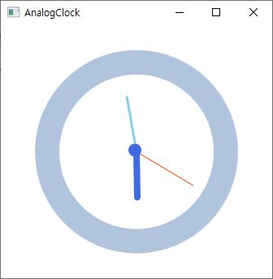
### MonteCarloPiApp
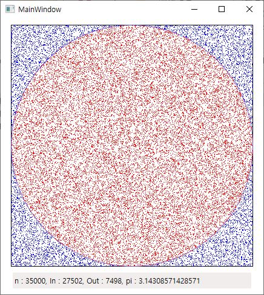
### SnakeBiteGame
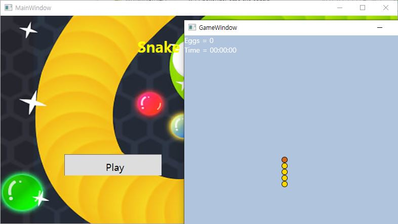

### WpfLoginApp
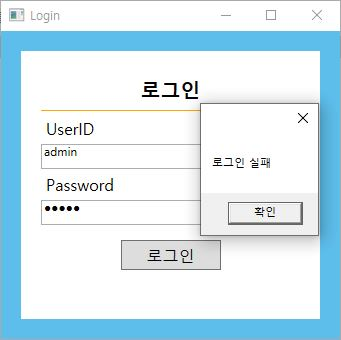
### ModernUITestApp
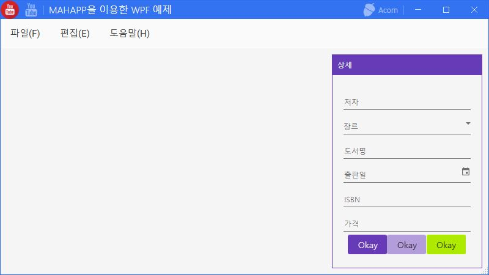
### WpfPracticeApp
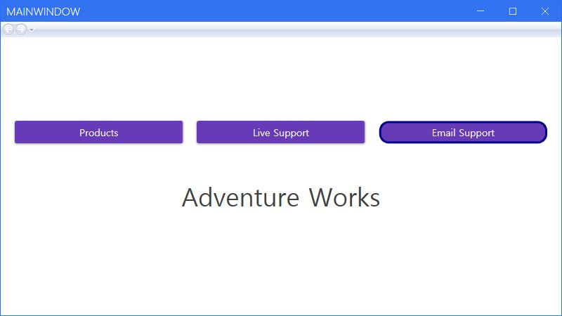
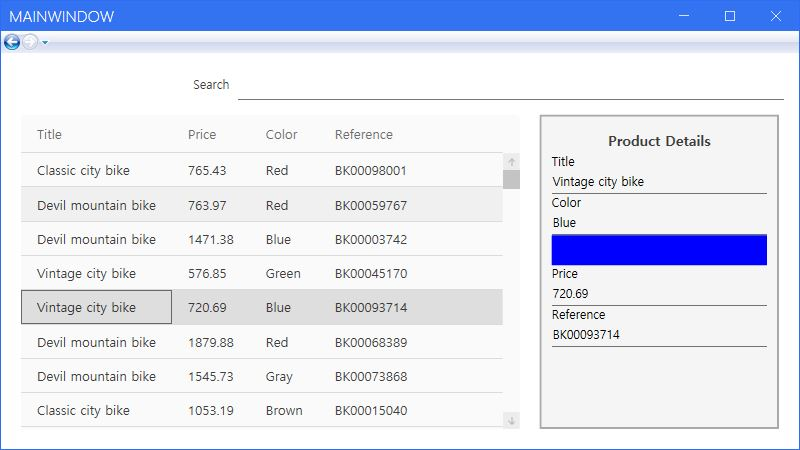
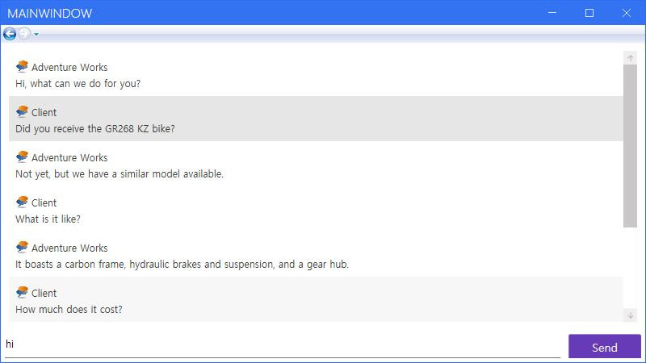
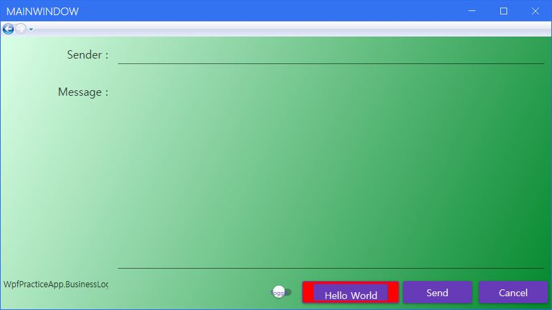
### WpfTestApp
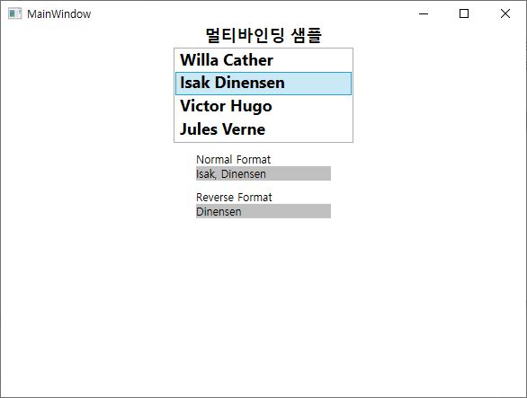
------------------------
## 🌏FineDustMonApp (Mini Project)
C# WPF와 공공 데이터 API를 이용하여 시간대별 
부산 지역 내 미세먼지 관측량을 확인할 수 있는 프로그램입니다. 
>>  
>>__- 시작 프로그램__
>   
>         
>   
>>  
>>__- 좌동 검색 결과__
>   
>         
>   
>>  
>>__- 부곡동 검색 결과__
>   
>         
>   
>[(해당 프로젝트)](WpfAdvBank/FIneDustMonApp)
