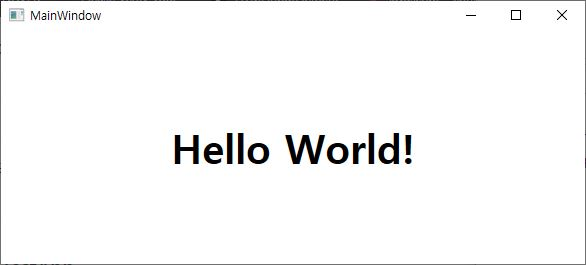
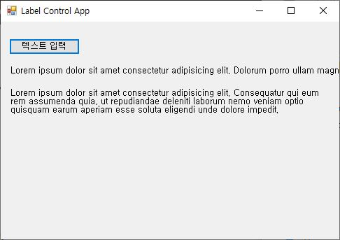
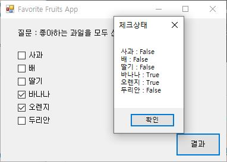
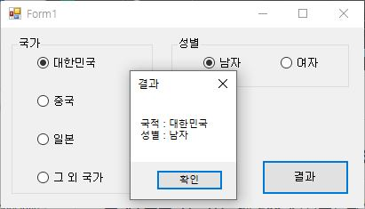
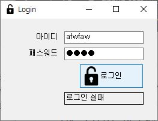
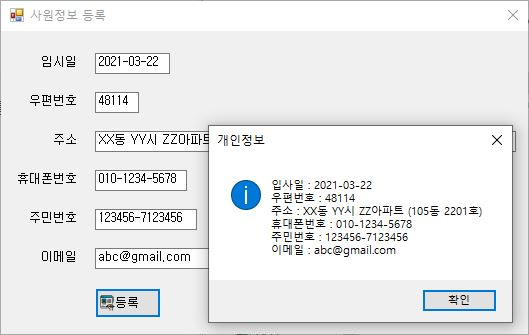

# C# WinForm Exercise

__교재 : 초보자를 위한 C# 200제__ (정보문화사)를 참고하였습니다. 

### HelloWpfApp
  
### LabelTestApp

### CheckBoxWinApp

### RadioWinApp

### LoginApp

### MaskedTestApp

### ColorChangeApp
![ColorChangeApp(images/ColorChangeApp.JPG)

### ListboxWinApp
### RestaurantSelApp
### TravelWishApp
### ListViewApp
### StudyHistoryApp
### DigitalClockApp
### DateCalcApp
### AlarmClockApp

### WinCalculatorApp
### MyNotePadApp

### ImageViewerApp
### WinChartApp
### AddressInfoApp
### IoTSensorMonApp

------------------------
## "BookRentalShopApp" (Mini) 
