# C# WinForm Exercise

__교재 : 초보자를 위한 C# 200제__ (정보문화사)를 참고하였습니다. 

### HelloWpfApp
  
### LabelTestApp

### CheckBoxWinApp

### RadioWinApp

### LoginApp

### MaskedTestApp

### ColorChangeApp
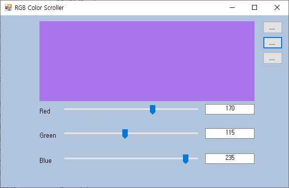

### ListboxWinApp

### RestaurantSelApp

### TravelWishApp
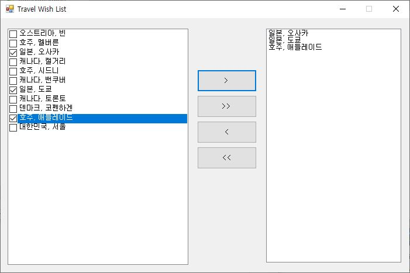
### ListViewApp
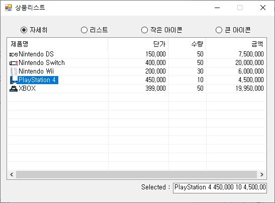
### StudyHistoryApp
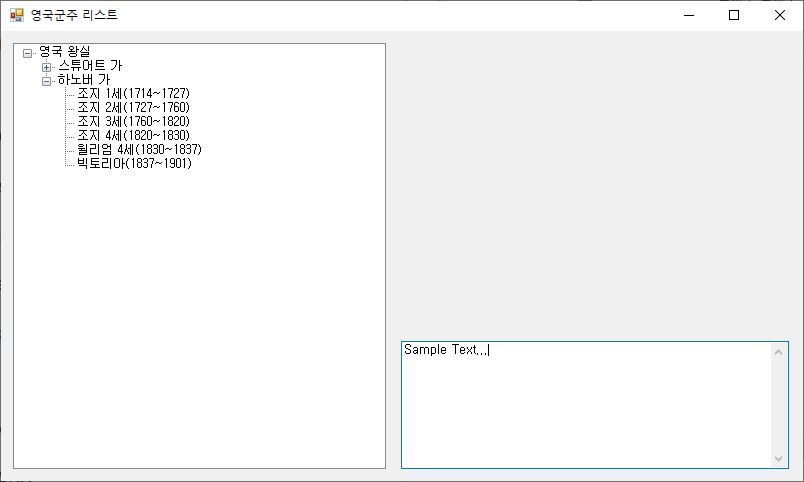
### DigitalClockApp
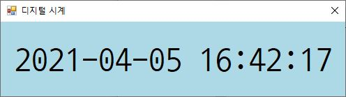
### DateCalcApp
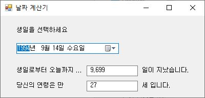
### AlarmClockApp
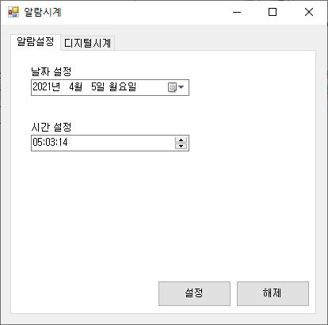

### WinCalculatorApp
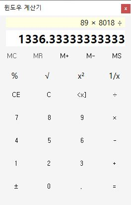
### MyNotePadApp
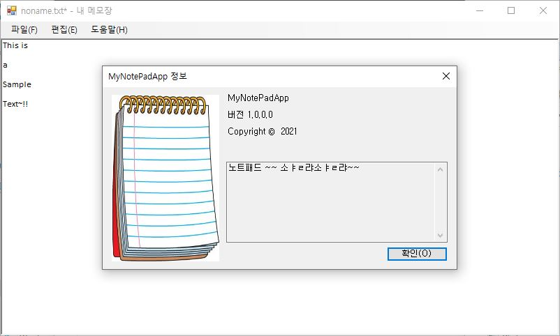

### ImageViewerApp
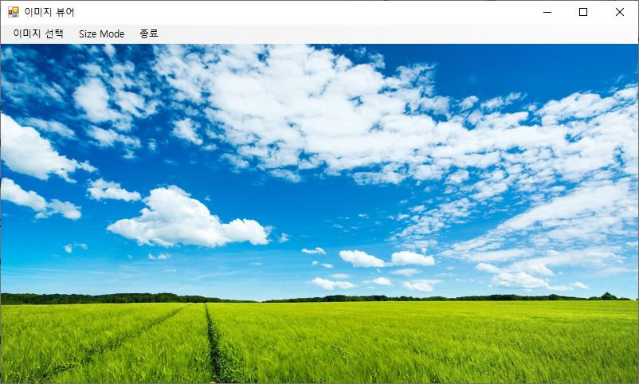
### WinChartApp
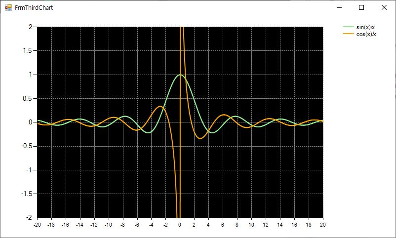
### AddressInfoApp
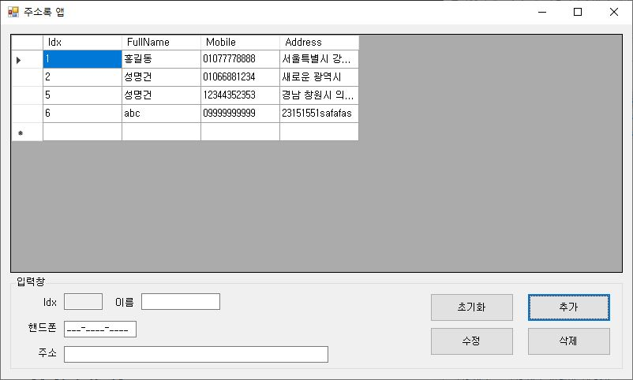
### IoTSensorMonApp
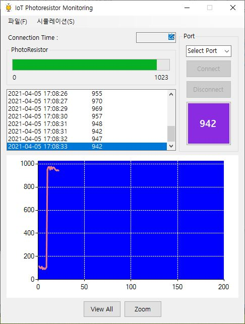
------------------------
## 📚BookRentalShopApp (Mini Project)
C#의 윈폼과 Microsoft SQL Server을 이용하여 
책 관리 및 대여 시스템(프로그램)을 작성했습니다. 
>>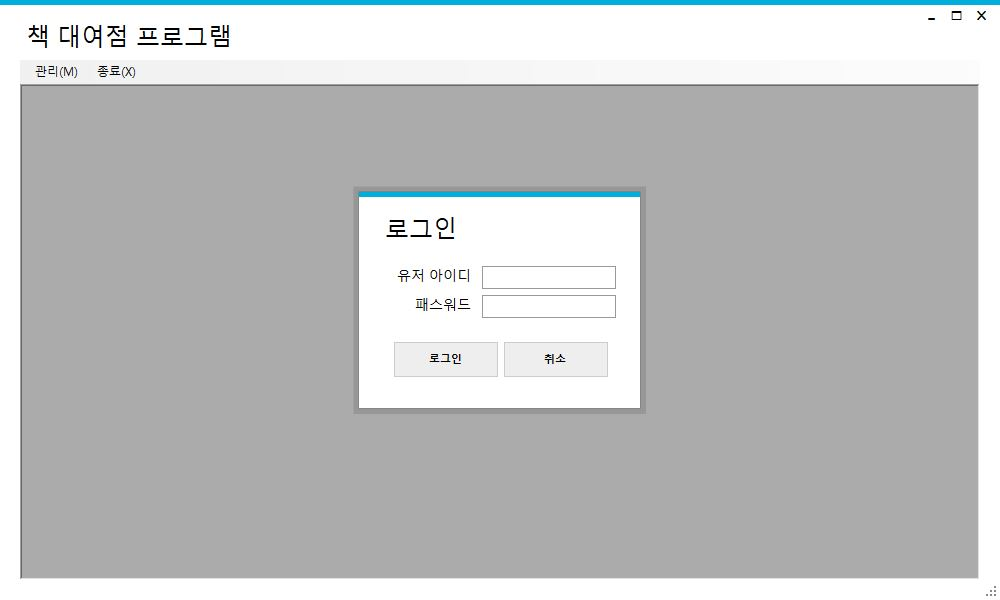  
>>__- 로그인 화면__
>   
>         
>   
>>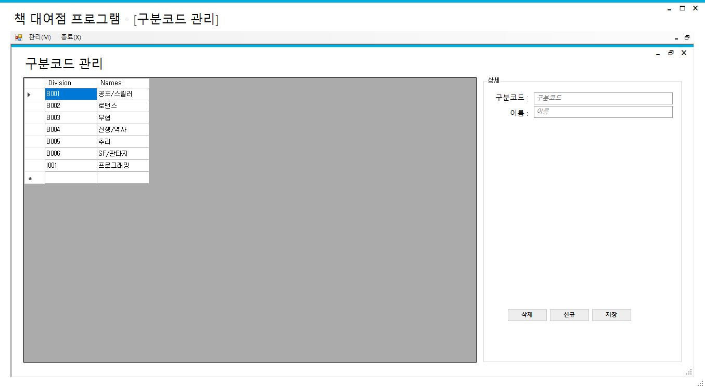  
>>__- 코드 관리__
>   
>         
>   
>>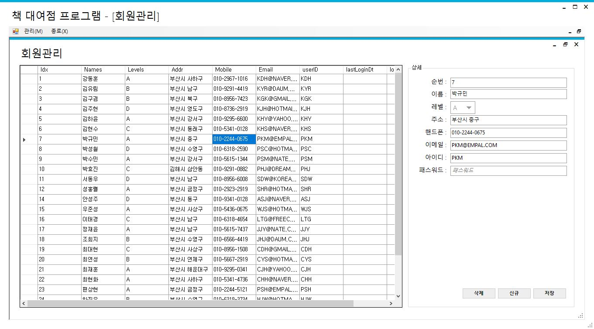  
>>__- 회원 관리__
>   
>         
>   
>>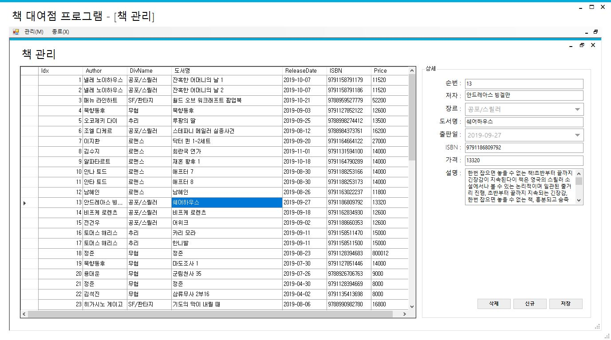  
>>__- 책 관리__
>   
>         
>   
>>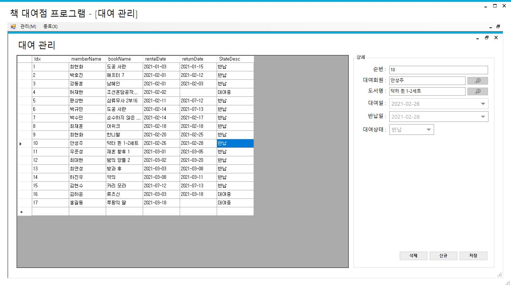  
>>__- 대여 관리__
>   
>         
>   
>[(해당 프로젝트)](WinFormAdvancedBank/BookRentalShopApp)

