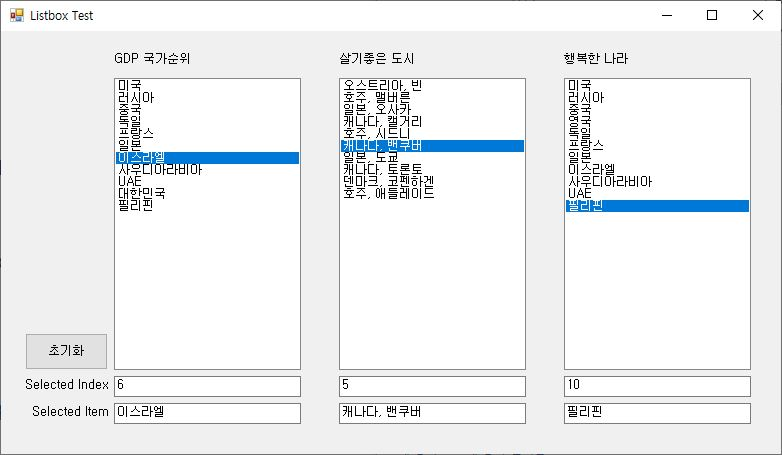

# C# WinForm Exercise

__교재 : 초보자를 위한 C# 200제__ (정보문화사)를 참고하였습니다. 

### HelloWpfApp
  
### LabelTestApp

### CheckBoxWinApp

### RadioWinApp

### LoginApp

### MaskedTestApp

### ColorChangeApp

### ListboxWinApp

### RestaurantSelApp

### TravelWishApp

### ListViewApp

### StudyHistoryApp

### DigitalClockApp

### DateCalcApp

### AlarmClockApp

### WinCalculatorApp

### MyNotePadApp

### ImageViewerApp

### WinChartApp

### AddressInfoApp

### IoTSensorMonApp

------------------------
## "BookRentalShopApp" (Mini) 
